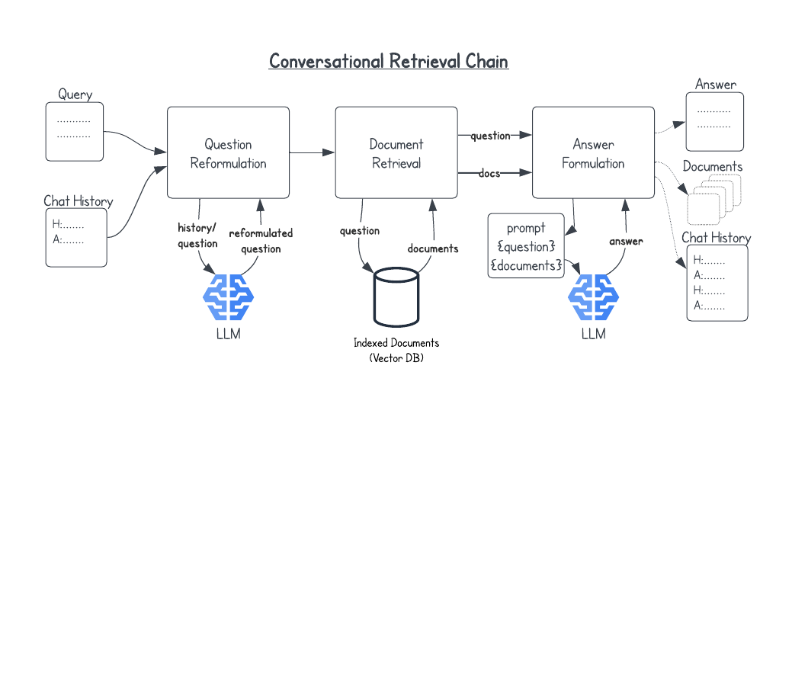

# RAG Query Chain

The conversational retrieval chain demonstrated in this repository is
an example of software implementing a Generative AI conversational
experience with a a set of documents indexed for embedding-based
retrieval. It also describes the individual components of the chain,
their function, opportunities for customization, and workarounds for
issues we have encountered.



## Conversational Retrieval Chain Components

### Retrieval

The heart of a retrieval-augmented generation system is the retriever
that takes the input query and returns a set of texts related to the
query that will be used to answer the question.

- An embedding model (e.g., `amazon.titan-embed-text-v1` in AWS Bedrock)
- A vector database (e.g., Postgres PGVector)
- LangChain objects for vector database and retriever (e.g., `PGVector.as_retriever()`)

Some of the settings that can be used to affect retrieval are:

- The maximum number of documents to return (`k`)
- A filter condition on document metadata which is specific to your
  documents' metadata and to the filter language for your vector
  database (`filter`)
- A similarity score threshold. This is available in the retrievers
  created from the `PGvector` vector database and only returns
  documents that score above a specified relevance threshold
  (`search_type` and `score_threshold`)

Here as an example of creating a retriever with a maximum number
of returned documents of 10, a filter to only return PDF documents
(using some made-up document metadata) and with a similarity
score threshold of 0.5.

```
embeddings = BedrockEmbeddings(
    model_id="amazon.titan-embed-text-v1",
)
db = PGVector(
    embedding_function=embeddings,
    collection_name=<collection_name>,
    connection_string=<connection_string>,
)
retriever = db.as_retriever(
    search_type = "similarity_score_threshold",
    search_kwargs = {
        "k": 10,
        "filter": {"doc_type": "pdf"},
        "score_threshold": 0.5,
    }
)
```

### Memory

The memory in a conversational retrieval chain keeps track of the back
and forth interactions between the user and the chain to be used
provide context, often in the form a rephrasing a later question
in the conversation chain to be context-free using the earlier
question/answer pairs, although this can be done in other ways
and the question/answer memory can be used for other purposes as well.

The conversational retrieval chain can remain in memory for the
duration of the conversation then the LangChain object
`ConversationBufferWindowMemory` can be used to automatically maintain
the history. The `k` parameter determines how many interactions to
keep.

If the retrieval chain needs to be stateless and/or the chat history
needs to be handled externally, the chain can use the
`ConversationBufferMemory` with the pre-query history being provided
as a `ChatMessageHistory` object or a subclass. Note that the a
conversational retrieval chain using `ConversationBufferMemory` expects
the associated `ChatMessageHistory` to be empty when the chain is
invoked (i.e. it should not contain the query) and the chain will
populate the message history with both the query and the answer
before returning.

### Conversational Context

By default the conversational retrieval chain uses context-free
question reformulation to achieve a conversational style. The 
reformulation is done by a call to the provided model to
produce a question where ambiguities are resolved from the
chat message history.

If you are using streaming to provide real-time updates on the
response to the user it is a good idea to provide a separate,
non-streaming model to the retrieval chain for the question
reformulation using the `condense_question_llm` parameter. Otherwise,
the user will see the reformulated question streamed before
the response from the primary response generation.

### Response Generation

The conversational retrieval chain produces the final response for the
user by filling the prompt template with `{context}` coming from the
a call to `get_relevant_documents` on the retriever and the `{question}`
that is either the original question, or a reformulation from the 
conversational history.

A custom prompt can be provided that uses the appropriate 
placeholders for `{context}` and `{question}`:

```
PROMPT_TEMPLATE = """Provide a helpful answer to the
QUESTION using the provided CONTEXT. If you can't find
the answer in the CONTEXT say that you don't know.

<CONTEXT>
{context}
</CONTEXT>

<QUESTION>
{question}
</QUESTION>

Helpful Answer:
"""

qa_prompt = PromptTemplate(
    template=PROMPT_TEMPLATE,
    input_variables=["context", "question"],
)
query_chain = ConversationalRetrievalChain.from_llm(
    llm=model,
    memory=memory,
    retriever=retriever,
    return_source_documents=True,
    combine_docs_chain_kwargs={"prompt": qa_prompt},
)
```

We've seen that large language models can give unsatisfactory answers
from retrieved context that it is only tangentially related to the
query. A nice option is to `search_type="similarity_score_threshold"`
and `score_threshold` as mentioned in the Retrieval section and
then provide a `response_if_no_docs` string as a parameter to
the `ConversationalRetrievalChain` constructor.

## Streaming

Enabling response streaming for the conversation retrieval chain is
done by passing `streaming=True` and providing an instance of a
streaming callback handler in the `callbacks` parameter to the primary
LLM used for answer generation. It is also necessary to create a
secondary LLM without streaming for the question reformulation part of
the retrieval chain using the `condense_question_llm`
parameter. Otherwise, the reformulated question will be streamed to
the user before the final response.

```
class MyStreamingHandler(BaseCallbackHandler):
    def on_llm_new_token(self, token: str):
        sys.stdout.write(token)
        sys.stdout.flush()

model = BedrockChat(
    model_id="anthropic.claude-3-sonnet-20240229-v1:0",
    streaming=True,
    callbacks=[MyStreamingHandler()],
)
question_llm = Bedrock(
    model_id="anthropic.claude-instant-v1",
    streaming=False,
)
query_chain = ConversationalRetrievalChain.from_llm(
    llm=model,
    memory=memory,
    retriever=retriever,
    return_source_documents=True,
    condense_question_llm=question_llm,
)
```

## Files

- [`query_chain.py`](query_chain.py) - The basic RAG conversational retrieval chain.
- [`query_chain_test.py`](query_chain_test.py) - A test script that instantiates
  a `QueryChain` using `BedrockChat` and `PGVector` and makes a query, with and
  without streaming.
- [`query_chain_ui.py`](query_chain_ui.py) - A streamlit UI for simple chatbot
  interaction with a query chain.
- [`bedrock_postgres_chain.py`](bedrock_postgres_chain.py) - A subclass of
  `QueryChain` specific to `BedrockChat` and `PGVector`.

## Guiding Principles

- Create a working skeleton of the conversational retrieval
  chain where the basic functions are maintained in one class
  that can be used in many contexts.
- The inputs of the base `QueryChain` class are the large
  language model (LLM), retriever, and system prompt at
  creation time, and then the new question/query and the
  the chat message history at query time.
- There is a `BedrockPostgresChain` subclass that is specialized
  to `BedrockChat` and a `PGVector`-based retriever.
- Streaming is enabled by using an LLM is streaming mode and
  by providing one or more instances of `BaseCallbackHandler`.

## Design/Implementation Questions

- Should the prompt be provided as a `str` or as a `PromptTemplate`?
  - The query chain is very brittle with respect to the `PromptTemplate`'s 
    input variables of `"context"` and `"question"`. It is worth looking into
    the LangChain machinery around prompts to see if we can enforce the
    presence of the correct inputs and use that to help enforce.
- Should the interaction method be custom like `ask_question` or should
  the class implement the `Runnable` interface or something similar?
  - My current thought is to use the custom `ask_question` method because
    of the stateless nature of the chain and requing the `ChatMessageHistory`
    to be provided or created from scratch. It is worth looking into
    whether the retrieval chain interfaces have an affordance for passing
    in memory, in which case it might make sense to switch.

## To Do

- [ ] Add labeled diagram of flow
- [ ] Add similarity threshold and no-doc-found message to code
- [ ] Add `requirements.txt`
- [ ] Add installation instructions
- [ ] Fix streaming in streamlit UI


